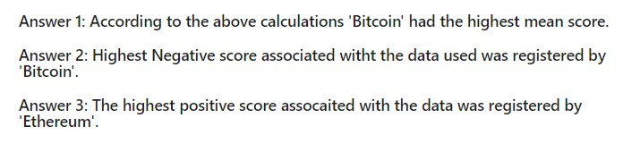
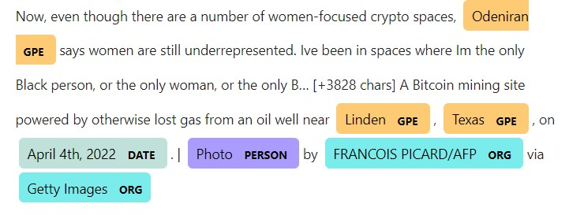

### NLP Home Work:
In this Home Work three tasks were given about the price of 'Bitcoin' and 'Ethereum'.These tasks are as follows:
1. Sentiment Analysis.
2. Natural Language Processing.
3. Named Entity Recognition.
#### Sentiment Analysis :
News articles were pulled using api for both the aforementioned crypto currencies.
This data was then processed and vader sentiment analysis was conducted on this data to get the sentiment score.Following observations were made :

#### Natural Language Processing :
The purpose of this task was to create a word cloud of n-grams, but before this, data was tokenized and processed.Following image was the result of this process :
1.Bitcoin bigram word cloud:

2.Ethereum bigram word cloud:

#### Named Entity Recognition :
In this activity every named entity was to be tagged in the data regarding 'bitcoin' and 'ethereum'. The library/dependency used for this task is 'spacy'.Following is an example of the output of such task:
